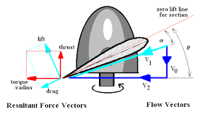
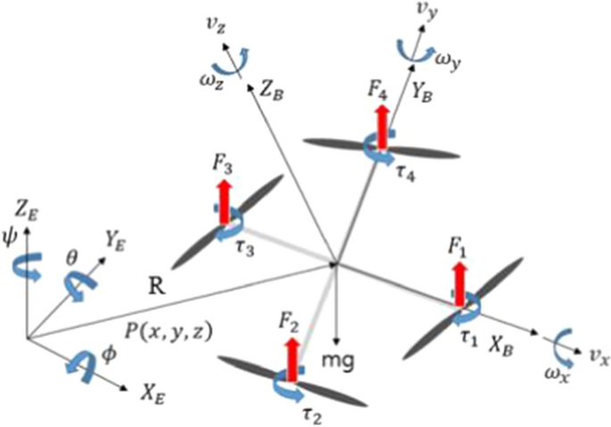
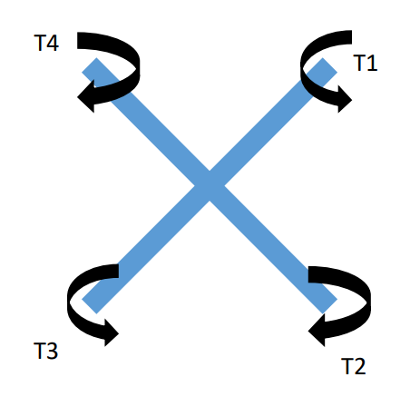
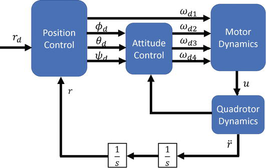
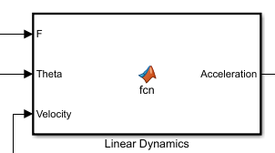
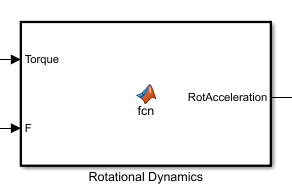
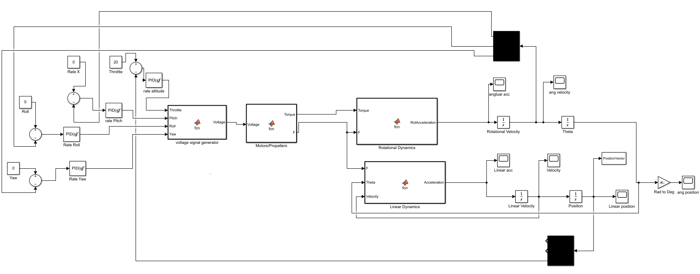

### Mentors

- Vasanth M
- Shannon Britney Carlo
- Shriramu A R

### Members

- Anani Mani Tripathi
- Goti Dev Pankajbhai
- B Manasa Priya Chandana
- Srinath Seshadri
- Krisha Shah
- Nischith Gowd Hanchanahal

## Aim

To get a clear understanding and to visualize the dynamics and control implementation of various systems starting from basics and extending it to drone, a simulink model will be built after thoroughly understanding the drone dynamics.

## Introduction

Today, drones are everywhere, from ultra high tech military devices to toys for kids going through advanced flying cameras and
much more. How do such ”apparently” simple machines achieve such precise and impressive flights in varying unstable and
unpredictable environmental conditions.

## Mechanical design

In this project the drone is assumed to be made of two beams placed perpendicular to each other as shown in the images.

### x-y plane view

### z-y or z-x plane view

- Length of bar: 335 mm
- Depth of bar: 60 mm
- Width of bar: 237 mm

### Moment of inertia

- About x axis (pitch axis), Ixx = 0.003 kg/m^2
- About y axis (roll axis), Iyy = 0.003 kg/m^2
- About z axis (yaw axis), Izz = 0.007 kg/m^2

## Battery motor and propeller specifications

### Battery

A lithium battery of nominal voltage 11.4 V is used.

- Power capacity: 43.6Wh
- Maximum allowed current: 77A

### Motor

Voltage vs Rpm values for a standard brushless dc motor is taken and used as  a reference. And based on this data an approximate equation directly relating voltage and Rpm is obtained and used in the simulation model.

### Propeller

The section of the propeller blades are similar to the airfoil section, so when accelerated rotationally will produce a thrust force upwards, and a torque due to the drag forces which opposes the motion of the propeller. So the propeller also should produce a equivalent torque to overcome the drag and load, and to keep the propeller in motion.

#### Thrust

thrust = ct ∗ 𝜌 ∗ 𝑛² ∗𝐷^4  
ct ->coefficient of thrust  
 𝜌-> density of air  
 n-> number of revolutions per second  
 D-> diameter of propellers  
 The value of ct is found to be related to the rpm by this equation  
 ct = (2x10^-15)*Rpm^3 - (4x10^-11)*Rpm^2 + (3x10^-7)*Rpm

#### Torque

Torque is related to Rpm using this relation  
tq = (4x10^-14)*Rpm^3 + (8x10^-12)*Rmp^2+ (3x10^-6)*Rpm

## Rigid body dynamics of drone

  

### Fundamendal equations of motion
  
In the x direction: 𝐹𝑥 = 𝑚𝑎𝑥  
In the y direction: 𝐹𝑦 = 𝑚𝑎𝑦 
In the z direction: 𝐹𝑧 = 𝑚𝑎z  
About the x-axis: Mx = <math xmlns="http://www.w3.org/1998/Math/MathML"><mrow><mrow><mi>Ixx</mi><mo> </mo><mover accent="true" accentunder="false"><mrow><mover accent="true" accentunder="false"><mrow><mi>θ</mi></mrow><mrow><mo>˙</mo></mrow></mover></mrow><mrow><mo>˙</mo></mrow></mover></mrow></mrow></math>  
About the y-axis: My = <math xmlns="http://www.w3.org/1998/Math/MathML"><mrow><mrow><mi>Iyy</mi><mo> </mo><mover accent="true" accentunder="false"><mrow><mover accent="true" accentunder="false"><mrow><mi>ϕ</mi></mrow><mrow><mo>˙</mo></mrow></mover></mrow><mrow><mo>˙</mo></mrow></mover></mrow></mrow></math>  
About the z-axis: Mz = <math xmlns="http://www.w3.org/1998/Math/MathML"><mrow><mrow><mi>Izz</mi><mo> </mo><mover accent="true" accentunder="false"><mrow><mover accent="true" accentunder="false"><mrow><mi>ψ</mi></mrow><mrow><mo>˙</mo></mrow></mover></mrow><mrow><mo>˙</mo></mrow></mover></mrow></mrow></math>  

### Final rigid body equtions

𝑀𝑧 = 𝑇4 − 𝑇1 + 𝑇2 − 𝑇3  
𝑀𝑥 = (𝐹3 + 𝐹4) ∗
0.237/
2
− (𝐹1 + 𝐹2) ∗
0.237/
2  
𝑀𝑦 = (𝐹3 + 𝐹2) ∗
0.237/
2
− (𝐹4 + 𝐹1) ∗
0.237/
2  
𝐹𝑝𝑟𝑜𝑝𝑥
= sin<math xmlns="http://www.w3.org/1998/Math/MathML"><mi>ϕ</mi></math> ∗ cos𝜃 ∗ (𝐹1 + 𝐹2 + 𝐹3 + 𝐹4)  
𝐹𝑝𝑟𝑜𝑝𝑦
= sin𝜃 ∗ cos<math xmlns="http://www.w3.org/1998/Math/MathML"><mi>ϕ</mi></math> ∗ (𝐹1 + 𝐹2 + 𝐹3 + 𝐹4)  
𝐹𝑝𝑟𝑜𝑝𝑧
= cos𝜃 ∗ cos<math xmlns="http://www.w3.org/1998/Math/MathML"><mi>ϕ</mi></math> * (𝐹1 + 𝐹2 + 𝐹3 + 𝐹4)

## Implementing the model in matlab and simulink

Normally drone control system consist of two control blocks, position control and attitude control. But this project focuses only on the attitude control block plus the throttle control.

### Control system representation of drone

### Motor and propeller block

Input : Voltage[V] (4x1 - vector)  
Output : Thrust[F] torque[T]  (4x1 - vector)

In this block the voltage supplied to each motor is taken as an input and the thrust and the torque generated by each motor is given as an output.

### Linear dynamics block

Input : Thrust[F] Attitude[theta] Vecocity[v]  
Output: Acceleration[a]

Here theta denotes the roll, pitch and yaw angles. Velcoity is taken as an input to calculate the drag forces.

### Rotational dynamics block

Input: Thrust[F] Torque[T]  
Output: Angular acceleration[alpha]

With the help of rigid body equations and calculated values of moment of inertia, the angular acceleration vector is calculated using the thrust and torque values.

### PID controllers

The simulink model consist of four PID controllers  
1-> For attaining the desired altitude.  
2-> For attainging the desired pitch rate.  
3-> For attaining the desired roll rate.
4-> For attaining the desired yaw rate.

## Simulation results

- First plot shows the altitude as a function of time. In this simulation the attitudes are assumed to be constants.

- Second plot shows the angulare velocities as a function of time, here throttle input is assumed to be constant.

## Conclusion

- We simulated a mavic pro drone in matlab and simulink and used PID controllers for altitude control. We used mathematical equations behind the rotational and linear dynamics of the drone to implement a mathematical model in matlab and simulink using blocks. Later PID controllers were used to control the position and altitude of the drone.
- Further plans to add position controller and trajectory planner to this model and to simulate a drone following a pariticular trajectory in 3-d space.

## References

1. Modeling, Simulation and Control of Quadcopter using PID Controller, [Link](https://www.researchgate.net/publication/334965830_Modeling_Simulation_and_Control_of_Quadcopter_using_PID_Controller)
2. MODELING, SIMULATION AND COMPLETE
CONTROL OF A QUADCOPTER, [Link](https://harikrishnansuresh.github.io/assets/quadcopter_control_project_report.pdf)
3. Simulink-based Quadcopter Control System Model, [Link](https://ieeexplore.ieee.org/document/9314676)
4. Matlab tech talks, [Link](https://in.mathworks.com/videos/drone-simulation-and-control-part-1-setting-up-the-control-problem-1539323440930.html)
